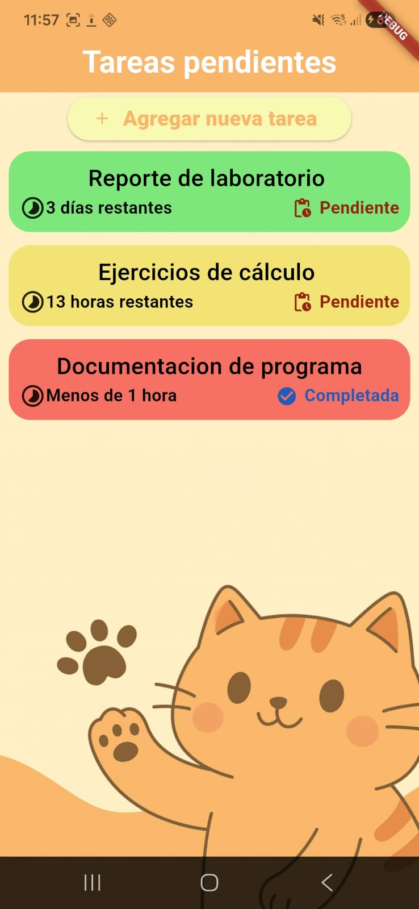
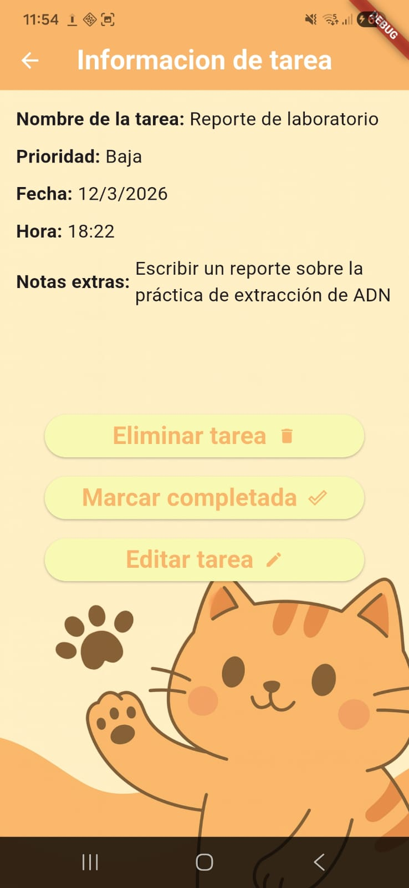
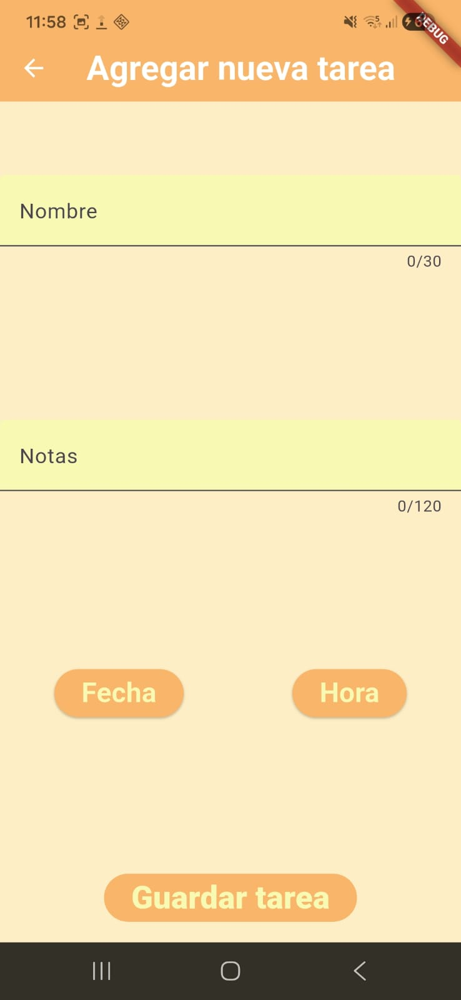

# Task Manager App

Aplicación móvil desarrollada en Flutter orientada a la gestión de tareas pendientes. El proyecto fue desarrollado con el objetivo de demostrar la capacidad de construir una aplicación móvil funcional y gestionar la navegación entre múltiples pantallas con paso de datos dinámico.

## Funcionalidades

- Crear, editar y eliminar tareas
- Marcar tareas como completadas
- Gestión de fechas límite
- Cálculo dinámico del tiempo restante
- Indicadores visuales de urgencia por colores
- Navegación entre pantallas con envío y recepción de datos

## Capturas de Pantalla de la App

Home:

Detalle de tarea:

Agregar tarea:

## Tecnologías utilizadas

- Flutter
- Dart

## Autores

- Samuel Flores – Diseño UI
- Elizabeth Gómez – Lógica, funcionalidad e implementación

## Estado del proyecto

Proyecto académico incluido como parte de portafolio profesional.
